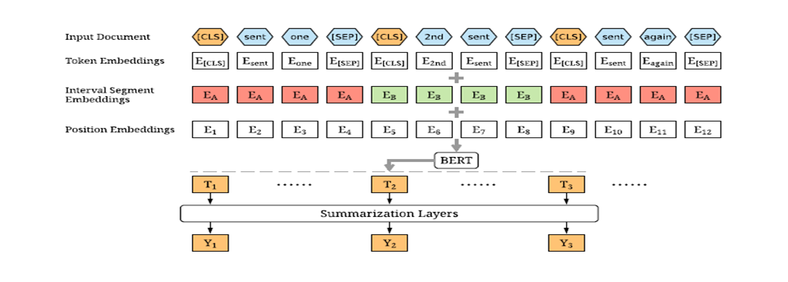
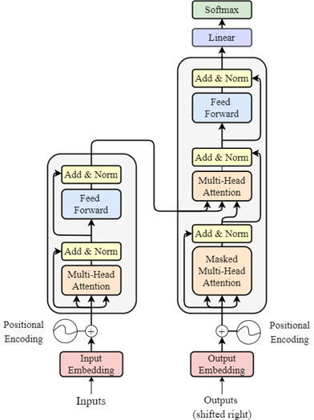
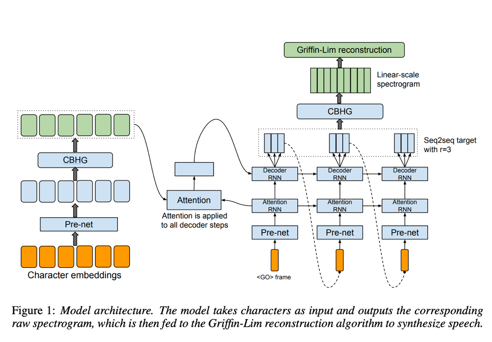
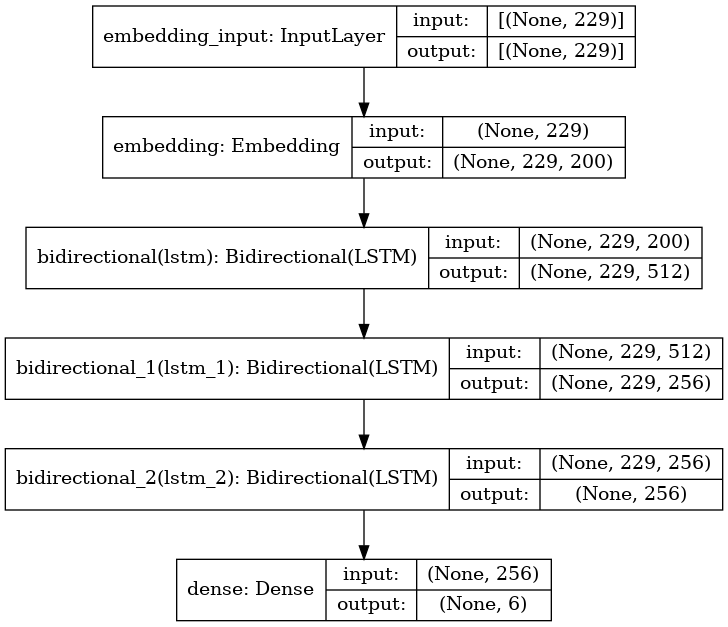
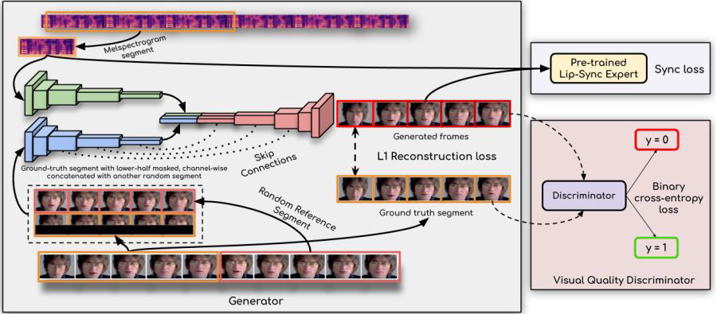

# Speak News Graduation Project

## Abstract

Traditional news reading methods often feel tedious and time consuming, leading to decreased engagement and information overload. To address these challenges, we present an interactive news summarizer system that leverages avatar narration and text to speech conversion techniques. Our solution aims to revolutionize news consumption by providing concise news summaries that can be effortlessly listened to or visually experienced through avatars. Recognizing the growing dissatisfaction with traditional news reading formats and the need for efficient information consumption, our system tackles these issues head on. By utilizing advanced natural language processing and machine learning techniques, we automatically generate comprehensive news summaries, condensing key information from articles. Our application offers users an enhanced news consumption experience by providing concise news summaries through avatar narration and text to speech conversion. Users can effortlessly listen to or visually experience news articles, overcoming the boredom and time constraints associated with traditional reading methods. By condensing key information using advanced natural language processing techniques, our system ensures accurate and digestible summaries. The integration of text to speech conversion generates immersive audio, while avatar narration offers a visually engaging alternative. Users will benefit from efficient and personalized news consumption, catering to their preferences and enabling them to stay informed conveniently.

## Project Poster


## Full System Block Diagram


=======
## Models

### Summarization Module

#### Extractive Summarization Module

##### Modifying BERT encoder to fit the Summarization task




#### Abstractive Summarization Module

##### Encoder-Decoder Transformer Model



### Text to Speech Module

##### The Full Text-To-Speech Module Architecture



### Sentiment Analysis Module

##### The Sentiment Analysis Module Architecture



### Avatar Generation Module

##### The Full Lib Syncing Module Architecture



## Datasets

The following datasets were used for the comparative analysis:
• LJ Speech for Tacotron Model.
• CNN Daily Mail for Text Summarizer.
• BBC LRS 2 Lip syncing dataset for Avatar Generation.
• Twitter Sentiment dataset for text sentiment analysis.

## Evaluation Metrics


## Results


## Usage

To run the project, run the following commands:
```
    
```

## Contributers

- [Ahmed Ehab](https://github.com/ahmedehabb)
- [Abdallah Wael](https://github.com/abdallahwaseem)
- [Mohamed Amr](https://github.com/mohamedafifi13)
- [Youssef Qadry](https://github.com/yousefQadry)
